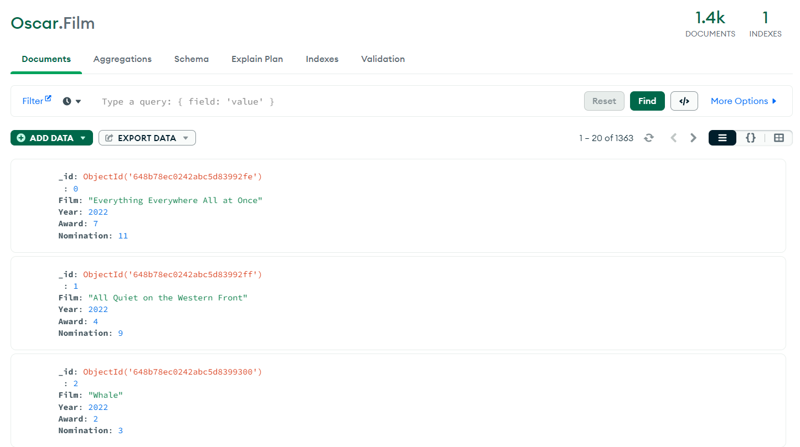

# Oscar-website

Questo sito web basato su Flask e Mongo Db permette di effettuare operazioni su una serie di film candidati agli Oscar e visualizzare una serie di statistiche inerenti ad esse.

Il dataset iniziale è stato preso da Kaggle al seguente link :
https://www.kaggle.com/datasets/pushpakhinglaspure/oscar-dataset

Per quanto riguarda il database implementato in MongoDB è necessario implementare un DataBase chiamato Oscar con all'interno una collezione chiamata Film.

Per avviare l'applicazione eseguire il file app.py e connettersi al http://localhost:5000/

Il sito presenta:
- una sezione **Home** in cui è possibile interrogare il database e recuperare i film in base all'anno, al nome, al numero di awards e nomination.
- una sezione **Database** che presenta il database iniziale sul quale vengono effettuate le operazioni.
- una sezione **Operazioni** attraverso la quale è possibile eliminare, aggiungere o modificare un film in base a vari parametri.
- una sezione **Statistiche** nella quale è possibile visualizzare alcuni grafici statistici sui dati.
